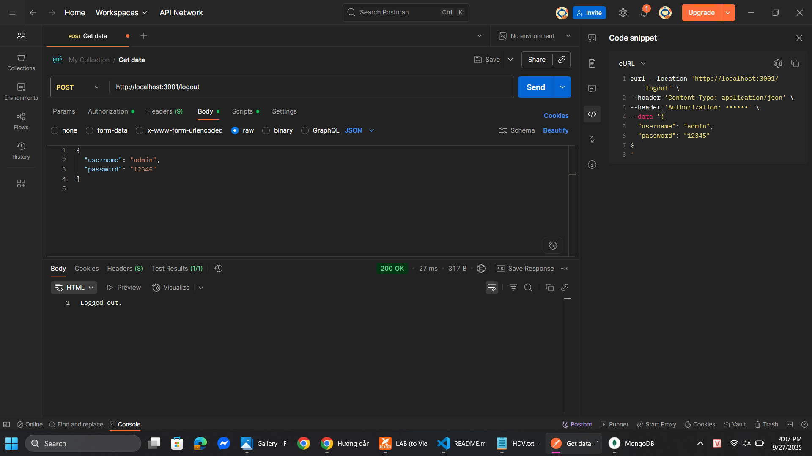
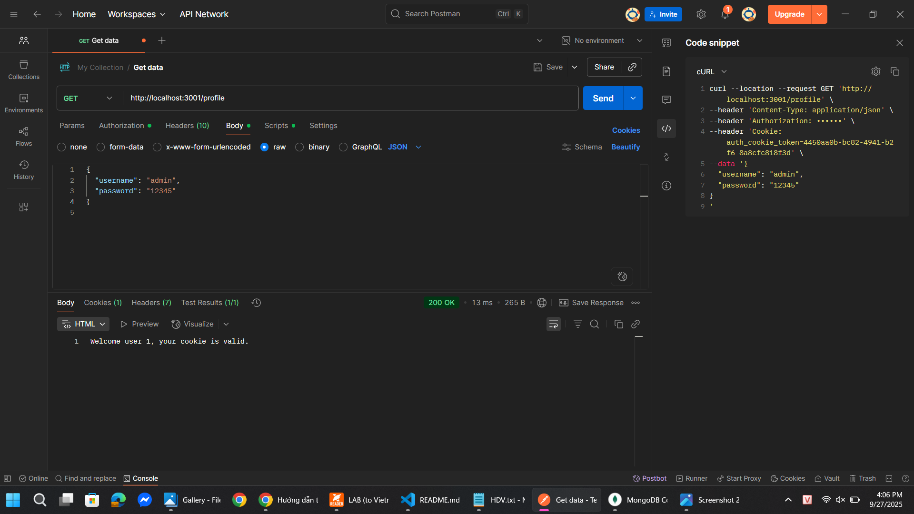

# Simple Auth - Basic Authentication

## Cách chạy

```bash
node basic_auth.js
```

Server chạy tại: `http://localhost:3000`

## API Endpoints

* `GET /` → Public
* `GET /public` → Public
* `GET /secure` → Bảo vệ bởi Basic Auth

## Cách test với Postman

1. Mở Postman → tạo request `GET http://localhost:3000/secure`.
2. Vào tab **Authorization** → chọn `Basic Auth`.
3. Nhập:

   * Username: `admin`
   * Password: `12345`
4. Gửi request.

## Kết quả

* Nếu không nhập `Authorization` → trả về `401 Authentication required`.
* Nếu nhập sai username/password → trả về `403 Access denied`.
* Nếu nhập đúng → trả về:

  ```
  You have accessed a protected resource 🎉
  ```

## Xem header `Authorization`

* Sau khi nhập username/password ở tab **Authorization**, Postman sẽ tự sinh header.
* Vào tab **Headers** để thấy:

  ```
  Authorization: Basic YWRtaW46MTIzNDU=
  ```
* Hoặc nhấn nút **Code (</>)** ở góc phải để xem request (ví dụ cURL) kèm header.

## Hình minh họa

Đặt hình test trong thư mục `public/results/`:

* `public/results/secure.png`
* `public/results/public.png`
* `public/results/mongo_cookies.png`


# Simple Auth - Cookie Auth

## Run

```bash
node cookie_auth.js
```

Server: `http://localhost:3001`

## Test with Postman

### Login

* `POST /login`
* Body → Raw JSON:

```json
{
  "username": "admin",
  "password": "12345"
}
```

* Kết quả: `Logged in!`
* Tab **Cookies** → thấy `auth_cookie_token=...`

### Profile

* `GET /profile`
* Postman tự gửi cookie kèm request
* Nếu còn hiệu lực → `"Welcome user 1, your cookie is valid."`

### Logout

* `POST /logout`
* Cookie bị xóa khỏi DB và client
* Kết quả: `Logged out.`

## Results

Ảnh chụp test lưu tại `public/results/`

* `public/results/login.png`
* `public/results/logout.png`
* `public/results/profile.png`



